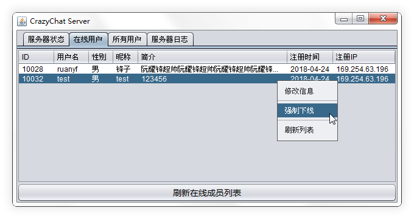

<h1 align="center">CrazyChat／疯聊</h1>

本项目是基于Java SE开发的即时通讯应用

GUI使用Swing实现，通过Socket实现客户端与服务端之间的通信

工程目录结构为Eclipse项目结构

## 项目特性／Features

##### 已实现功能

* 用户注册／登录／修改资料
* 查找／查看用户资料、添加好友、私聊
* 好友／群／会话列表
* 气泡式聊天界面
* 可拖拽改变窗口／分栏大小

##### 待实现的功能

* 查找／添加群、群聊
* 新消息提示

##### 存在的问题

* 在Windows7 Basic主题下窗口阴影显示异常，窗口大小拖拽异常
* 接收到消息时，消息记录无法滚动到最底部
* 由于Swing嵌套布局效率问题，消息数量较多时，调整窗口卡顿严重

## 目录说明／Directories

| 目录             | 说明                                        |
| ---------------- | ------------------------------------------- |
| CrazyChatClient  | 客户端工程（依赖通用模块）                  |
| CrazyChatCommons | 通用模块工程（客户端服务端Web端共用的代码） |
| CrazyChatServer  | 服务端工程（依赖通用模块）                  |
| CrazyChatWeb     | Web端工程（用于用户注册，依赖通用模块）     |
| DatabaseDesign   | 数据库设计相关文件                          |
| Documents        | 项目相关文档                                |
| ScreenShots      | 项目截图                                    |

## 项目截图／ScreenShots

### Web端

### 客户端

### 服务端

